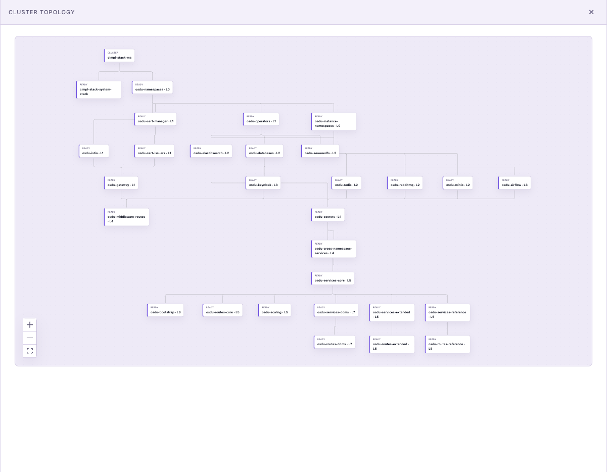

# @keelson/rib-osdu

The OSDU CIMPL "bridge" as a [Keelson](https://github.com/danielscholl/keelson) **rib** —
a discovery-based extension that contributes deterministic workflows whose structured
output drives live canvas views. The harness stays domain-free; all OSDU/cluster
knowledge lives here, and the rib ships **zero React** into the trusted SPA.

> Status: **early / under active design.** Five views work end-to-end today — the **Cluster ICC**
> (`cimpl info --json` + kubectl Flux/HelmRelease readiness), a kubectl Flux **topology graph**,
> plus three composite **boards**: **Quality** (`osdu-quality release --output json`), **Features**
> (`osdu-activity epic list` / `mr --output json`), and **Security** (`osdu-quality release` +
> GitLab/OSV CVE detail). The generic `board` view they render through landed in the Keelson base
> (gap G1), as did the top-level **surface** (gap G4) and in-board **actions** (gap G3) — so the rib
> composes the lane boards into one **CIMPL** nav tab with the Cluster ICC as its collapsible header
> (a "✓ Healthy" pill, a two-column Lifecycle | Actions body, and a unified ACCESS grid with
> copy-on-reveal credentials). Still ahead: the remaining surface regions
> (waiting-on-you, release train, events feed). See **[docs/PRD.md](docs/PRD.md)** for what the rib delivers and
> **[docs/ARCHITECTURE.md](docs/ARCHITECTURE.md)** for how it works + the Keelson base gaps
> it depends on. No resident sidecar; all data is one-shot CLI invocations.



## How it works

Each view is fed by a contributed workflow whose single node prints a canvas-view JSON
object; because the node declares `output_schema`, the executor promotes its stdout to
structured output, which the rib binding publishes (fail-closed: `canvasViewSchema`) to a
`rib:osdu:*` snapshot key the view is bound to.

```
osdu-cluster    →  bash: bun bin/collect-cluster.ts    →  board view  →  rib:osdu:cluster   →  "Cluster ICC"
osdu-topology   →  bash: bun bin/collect-topology.ts   →  graph view  →  rib:osdu:topology  →  "Cluster Topology"
osdu-quality    →  bash: bun bin/collect-quality.ts    →  board view  →  rib:osdu:quality   →  "Quality"
osdu-features   →  bash: bun bin/collect-features.ts   →  board view  →  rib:osdu:features  →  "Features"
osdu-security   →  bash: bun bin/collect-security.ts   →  board view  →  rib:osdu:security  →  "Security"
```

The **Cluster ICC** also wires the in-board **actions** (gap G3): its Reconcile / Suspend / Delete
buttons dispatch to the rib's `onAction` (`cimpl reconcile [--suspend|--resume]` / `cimpl down`), and
each ACCESS credential's copy button dispatches a `reveal-credential` action that re-fetches one
password on demand — the secret is written to the clipboard and never enters the board snapshot.

Each collector is a thin Bun script that shells a domain CLI and shapes its output with a
pure builder (no domain logic in rib glue, no analyzer reimplemented):

- **`src/cluster.ts`** — pure `buildClusterBoard({ info, lifecycle })`: the Cluster ICC **board** —
  a "✓ Healthy" header **status** pill + Flux/Services pulse, a two-column **Lifecycle | Actions**
  body (lifecycle rows: Context / Cluster reachable / Flux reconciled N/M / Services ready N/M, each
  toned by health; actions: Reconcile · Suspend-or-Resume · a destructive Delete), and a curated
  **ACCESS** card grid. `cimpl info` enumerates every Kubernetes service (the gateway, API-only
  endpoints, per-namespace Redis variants, an OIDC client secret); `ACCESS_SERVICES` curates that to
  the eight operator-facing services — browser portals (Airflow, Keycloak, Kibana, MinIO, RabbitMQ)
  get a green dot + portal `href` → ↗; cluster-local services (SeaweedFS, PostgreSQL, Redis) get a
  cyan dot and no link. **Credentials** join onto the matching card as boxed copy-on-reveal pills
  (the username shows; the password is fetched on copy) — Kibana carries the Elasticsearch credential
  (it fronts Elasticsearch, so there is no separate card). An internal `host:port` isn't an accessible
  URL, so no address pill is shown. `bin/collect-cluster.ts` shells `cimpl info --json
  --show-secrets` and reads kubectl `kustomizations`/`helmreleases` readiness; each source degrades
  independently to a valid "cluster unreachable" board. `--show-secrets` is used only to enumerate
  which services have credentials — passwords are stripped in the collector and never enter the board;
  a credential's password is re-fetched on copy via the `reveal-credential` action.
- **`src/topology.ts`** — pure `buildTopologyGraph(kustomizations)`: one node per Flux
  Kustomization (health in the node `kind`: `ready` / `blocked` / `suspended` / `failed`
  / `unknown`), edges from `spec.dependsOn`, dependency-free nodes rooted under the cluster.
  `bin/collect-topology.ts` reads `kubectl get kustomizations -n flux-system -o json`;
  degrades to a valid one-node graph when no cluster is reachable.
- **`src/quality.ts`** — pure `buildQualityBoard(report)`: a composite **board** — a
  good/poor/fail pulse, KPI tiles (services, avg accept/unit, critical-CVE count), and the
  per-service **table** (`buildQualityTable`, reused as a section) mirroring the CLI's columns
  (acceptance %, unit %, coverage %, Sonar reliability/security/maintainability, CVE C/H),
  worst-first. Cells carry a generic `tone` (`ok` / `warn` / `error`) so health reads as colour.
  `bin/collect-quality.ts` shells `osdu-quality release --output json` — the one-shot OSDU CLI,
  **no sidecar**; the CLI handles its own auth (`GITLAB_TOKEN` env or your `glab` login).
  Degrades to a valid empty board when the CLI is missing or errors.
- **`src/features.ts`** — pure `buildFeaturesBoard(epics, mrs, now)`: a Features **board** — a
  VENUS active/quiet pulse, MR KPI tiles (open / stale / blocked / ready), "Movers" cards
  (active epics with a progress bar) and "Stalled" rows (quiet/stale epics with a why-flagged
  note). `bin/collect-features.ts` shells `osdu-activity epic list` + `mr --output json`
  (sanitizing the epic CLI's unescaped control characters before parsing); degrades to a valid
  empty board when a CLI is missing or errors.
- **`src/security.ts`** — pure `buildSecurityBoard({ report, vulns, fixes, mrs, now })`: a
  Security **board** — a crit/high/med service pulse, KPI tiles (Critical / High / Medium /
  Vuln MRs), low-security-rating cards, top-offender severity **bars** (`crit · high`), aged-
  critical CVE cards (`>30d`), and dependency-bump quick wins. Counts/ratings come from the
  `osdu-quality release` report; CVE detail comes from `bin/collect-security.ts`, which also
  shells `glab api graphql` (group `vulnerabilities`) for per-CVE rows and queries OSV.dev for
  fix versions. Each source degrades independently — counts-based sections still render when
  GitLab/OSV are unreachable.
- **`src/index.ts`** — the `Rib`: five `views` descriptors, five contributed workflows that
  publish to them (each `validate`d fail-closed through `canvasViewSchema`), a **`CIMPL`
  surface** with the Cluster ICC as a collapsible header above the three lane columns, an
  `onAction` handler (the ICC's Reconcile/Suspend/Resume/Delete → `cimpl`, plus `reveal-credential`
  which returns one password to the caller for an on-demand clipboard copy), and an `authStatus`
  probe for the kubectl context.

No data is produced in rib code — the UI's data comes from running a workflow. The
`osdu-quality` and `osdu-activity` CLIs must be on `PATH` (e.g. `~/.local/bin`) and
authenticated (they fall back to `glab auth`, so no token wrangling in the common case).

## Develop against a local Keelson

```bash
bun install
bun link @keelson/shared        # resolves the contract from your local keelson checkout
                                # (or rely on the symlink dev/link.ts manages)

bun test            # pure builder coverage (topology + quality + features + security)
bun run typecheck
bun run check       # biome lint + format

# Wire the rib into a local Keelson checkout (defaults to ../keelson; override with KEELSON_DIR):
bun run link:keelson
cd ../keelson && KEELSON_RIBS=osdu bun dev
```

Then open `http://127.0.0.1:5173` → the **CIMPL** tab (or **Ribs**) → run a workflow (from the
Workflows surface or `keelson workflow run osdu-cluster` / `osdu-topology` / `osdu-quality` /
`osdu-features` / `osdu-security`) → the **CIMPL** surface composes them, with the **Cluster ICC**
as its collapsible header.

Smoke-test the collectors directly:

```bash
bun run collect:cluster | jq .   # shells `cimpl info --json` + kubectl flux/helm readiness
bun run collect:topology | jq .
bun run collect:quality | jq .   # shells `osdu-quality release --output json`
bun run collect:features | jq .  # shells `osdu-activity epic list` + `mr --output json`
bun run collect:security | jq .  # `osdu-quality release` + `glab` group vulns + OSV fixes
```

## Install into Keelson

Into an installed Keelson (the managed home at `~/.keelson`):

```bash
keelson rib add https://github.com/danielscholl/keelson-rib-osdu
keelson serve
```

`@keelson/shared` is provided by the harness as a peer dependency (a single copy
is shared across the harness and every rib), so it is not fetched separately.
Live data needs the OSDU toolchain on PATH — `cimpl`, `kubectl`, `osdu-activity`,
`osdu-quality`, `glab` — plus a reachable cluster and GitLab auth; without them
the rib still loads and its lanes render empty.

## Roadmap

The generic `board` view kind (gap **G1**, with cell tone **G0** and card link/copy **G2**), the
top-level **surface** (gap **G4** — a primary nav tab of region-bound boards), and in-board
**actions** (gap **G3** — buttons dispatched to the owning rib) have all landed in the Keelson base.
**Quality**, **Features**, and **Security** render as boards composed into one **CIMPL** surface,
with the **Cluster ICC** (a "✓ Healthy" pill, a two-column Lifecycle | Actions body with
Reconcile/Suspend/Delete, and a unified ACCESS grid with copy-on-reveal credentials) as its
collapsible header. Still ahead: the **Release Train**, **Waiting on You**, and **Current Events**
boards (which fill out the surface's banner/footer regions). Each lane wraps an existing OSDU/CIMPL
CLI (`osdu-quality`, `osdu-activity`, `cimpl info`) plus public CVE lookups (GitLab/OSV) — no
reimplemented analyzers, no resident sidecar.
See [docs/ARCHITECTURE.md](docs/ARCHITECTURE.md) for the gap taxonomy.

## Acknowledgments

This rib stands on OSDU community tooling. It bundles none of it; its collectors
shell these CLIs (installed on PATH) and shape their JSON output into generic,
domain-free Keelson views:

- **[CIMPL Stack](https://community.opengroup.org/osdu/platform/deployment-and-operations/cimpl-stack)**
  (Apache-2.0): the `cimpl` CLI behind the **Cluster ICC** and **topology** —
  cluster bootstrap and Flux GitOps for OSDU on Kubernetes. The cluster/topology
  shaping re-expresses its bridge composers (ported, never imported).
- **[AI DevOps Agent](https://community.opengroup.org/osdu/ui/ai-devops-agent/community)**
  (Apache-2.0): the `osdu-activity` and `osdu-quality` CLIs behind the
  **Quality**, **Features**, and **Security** lanes.

Full attribution lives in [NOTICE](NOTICE).

## License

Licensed under the [Apache License 2.0](LICENSE). See [NOTICE](NOTICE) for
third-party attribution.
