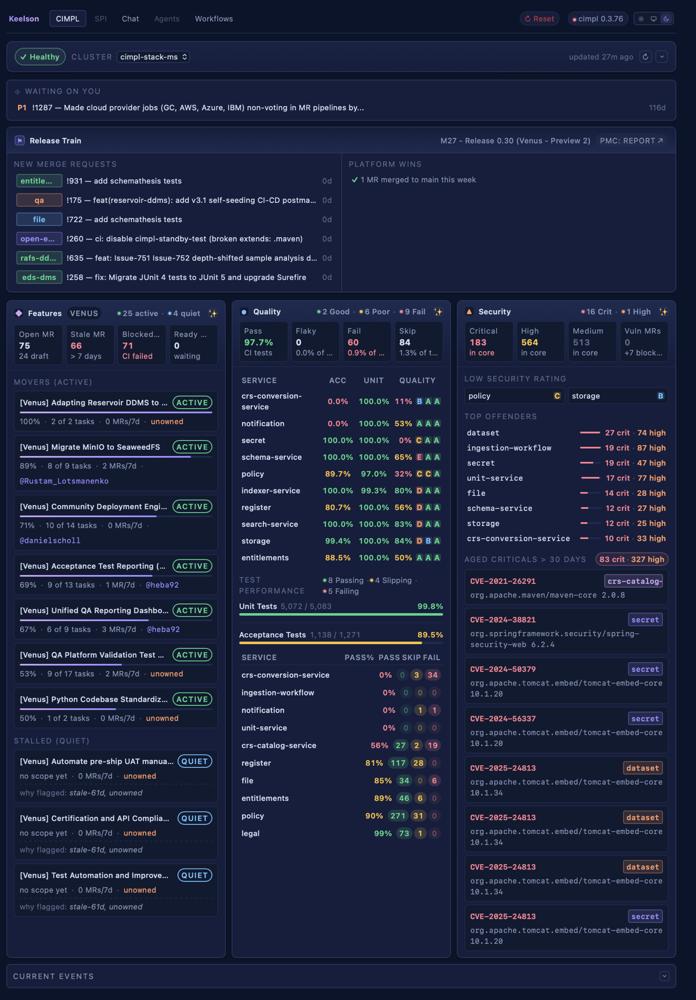
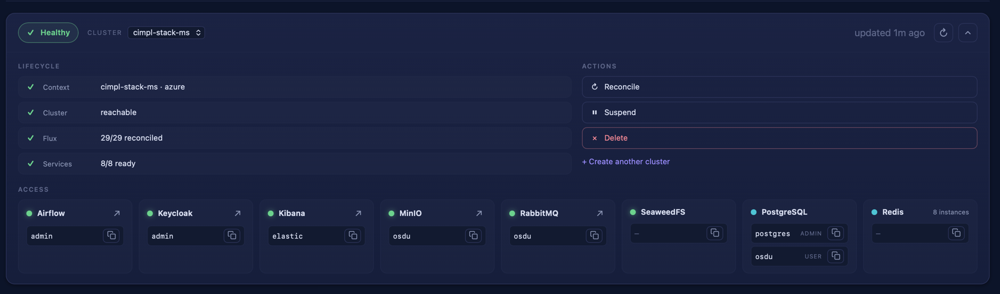
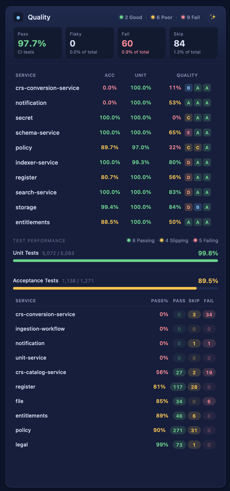
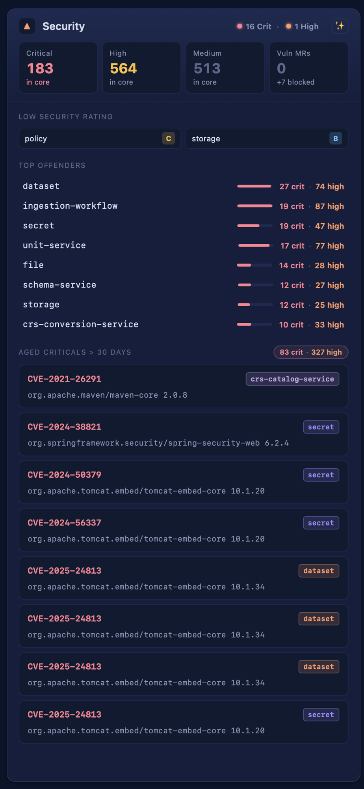
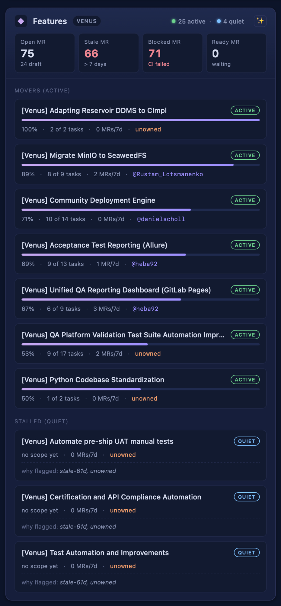
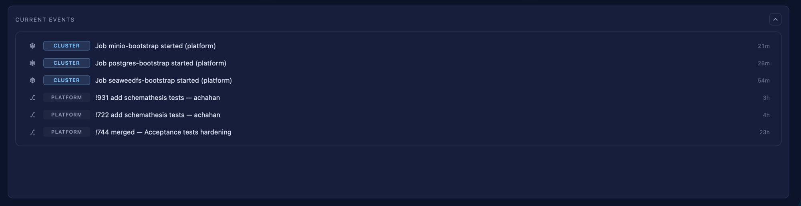

# PRD — `@keelson/rib-osdu` (the OSDU CIMPL bridge as a Keelson rib)

> Status: **draft / under active design.** This is the product definition for the
> rib. The companion [ARCHITECTURE.md](./ARCHITECTURE.md) covers how it's built and
> the Keelson base gaps it depends on.

## 1. Summary

`@keelson/rib-osdu` re-creates the **OSDU CIMPL "bridge"** — an operator dashboard for
an OSDU-on-Kubernetes deployment — as a Keelson **rib** (a discovery-based extension).
It surfaces, in one place: is my cluster healthy and how do I reach it; how are my
services doing on tests/coverage/security; what's moving and what's stalled in delivery.

The bridge already exists in the `cimpl-agent` fork, but built the wrong way for our
goals: its dashboards are **hand-coded React in the trusted SPA**, with OSDU section
names baked into the shared contract. The rib re-expresses the same surfaces as
**data produced by workflows and rendered by generic, domain-free Keelson views** — so
the harness carries zero OSDU knowledge and the rib ships zero React.

## 2. Who it's for / value

A CIMPL operator or OSDU platform engineer running a stack via the `cimpl` CLI. Today
they read this state across several terminal tools (`cimpl status`, `cimpl info`,
`osdu-quality release`, `osdu-activity`). The rib consolidates those into live,
color-coded views inside Keelson, refreshable on demand and (later) actionable
(reconcile / suspend) — without leaving the harness.

## 3. The surfaces

Every surface is a **composite** — not a single table or graph, but a small dashboard
of repeating visual primitives. (Primitive catalog and the Keelson gap are in
[ARCHITECTURE.md](./ARCHITECTURE.md) §Gaps.) Sourced from cimpl-agent's composers
(`packages/ext-cimpl-bridge/src/composer/*`).

### 3.0 The page (one top-level surface)

The bridge is **not** five separate views opened one at a time — it is a single,
full-width **top-level surface**: a named `CIMPL` tab in Keelson's primary nav, beside
Chat / Agents / Workflows. (cimpl-agent's nav also shows a sibling `SPI` tab — evidence
the model is "multiple ribs each owning a top-level tab," not a shared drawer.) The full
composed layout, top to bottom:

1. **Cluster header** — the Cluster board (§3.1), **collapsed by default** to a one-line status strip
   (`✓ Healthy · CLUSTER · cimpl-stack-ms ⌄ · updated 27m ago ⟳`); expands to lifecycle + actions + access.
2. **Waiting on You** (§3.7) — a single prominent priority row (`P1 !1287 … · 116d`).
3. **Release Train** (§3.6) — release header + New Merge Requests + Platform Wins.
4. **Three lane columns** — Features (§3.4) · Quality (§3.2) · Security (§3.3), side by side.
5. **Current Events** (§3.5) — a full-width feed, **collapsed by default** at the page bottom.

So the page is a **layout of regions, each region a board** (§3.1–§3.7), independently
refreshed (note the per-panel ✨ refresh on each lane and the `⟳` on the cluster header) and
some collapsible. This page-composition layer is the second Keelson gap after the board view
itself — see [ARCHITECTURE.md](./ARCHITECTURE.md) gaps **G1** (board) and **G4** (surface/layout).

The per-surface cimpl-agent UI/UX targets (reference screenshots in [`docs/design/`](./design)):

| Cluster | Quality | Security | Features | Current Events |
|---|---|---|---|---|
|  |  |  |  |  |

### 3.1 Cluster
The deployment's health + access panel. Three regions:
- **Lifecycle summary** — 4 status rows: Context (`cimpl-stack-ms · azure`), Cluster
  (`reachable`), Flux (`29/29 reconciled`), Services (`8/8 ready`), each with a health glyph.
- **Actions** — Reconcile · Suspend/Resume · Delete · "Create another cluster".
- **Access** — a grid of service cards (Airflow, Keycloak, Kibana, MinIO, RabbitMQ,
  SeaweedFS, PostgreSQL, Redis…), each a status dot + name + **portal link** + **copy-able
  credentials**.
- **Source:** `cimpl info --json [--show-secrets]` (access + suspended state); lifecycle
  counts derived from `kubectl` (kustomizations / helmreleases) the way `cimpl status` does.

### 3.2 Quality lane
- **Pulse** — segmented summary (`2 Good · 6 Poor · 9 Fail`).
- **KPI tiles** (4) — Pass % (CI tests), Flaky, Fail, Skip.
- **Sonar table** — worst-first services: `Service · ACC % · UNIT % · Quality` where Quality
  = coverage % + R·S·M letter badges (A–E, colored).
- **Test performance** — segmented summary (`8 Passing · 4 Slipping · 5 Failing`); two
  **progress bars** (Unit 5,072/5,083 = 99.8%; Acceptance 1,138/1,271 = 89.5%); a worst-
  acceptance **table** (`Service · Pass% · Pass · Skip · Fail`) with colored count badges.
- **Source:** `osdu-quality release --output json`.

### 3.3 Security lane
- **Header** — pulse summary `16 Crit · 1 High`.
- **KPI tiles** (4) — Critical `183 in core` · High `564 in core` · Medium `513 in core` · Vuln MRs `0 (+7 blocked)`.
- **Low security rating** — small cards: service + letter badge (`policy C`, `storage B`).
- **Top offenders** — rows: service + mini severity **bar** + `27 crit · 74 high` counts (colored).
- **Aged criticals > 30 days** — a summary chip (`83 crit · 327 high`) + CVE cards: CVE id (red) +
  service chip + affected package/version (`org.apache.tomcat.embed/tomcat-embed-core 10.1.20`).
- **Quick wins** (from cimpl-agent) — dependency bumps that clear crit/high CVEs.
- **Source:** `osdu-quality release --output json` (per-service `vulnerabilities`), plus GitLab
  vulnerability + OSV fix-version lookups for the CVE detail / quick-win rows.

### 3.4 Features lane
- **Header** — `VENUS` chip + pulse summary `25 active · 4 quiet`.
- **KPI tiles** (4) — Open MR `75 (24 draft)` · Stale MR `66 (>7 days)` · Blocked MR `71 (CI failed)` · Ready MR `0 (waiting)`.
- **Movers (active)** — cards: title + `ACTIVE` status pill + **progress bar** (completion %) +
  meta row (`100% · 2 of 2 tasks · 0 MRs/7d · owner`).
- **Stalled (quiet)** — cards: title + `QUIET` pill + meta + a **"why flagged"** footnote (`stale-61d, unowned`).
- **Source:** `osdu-activity epic list --output json` + `osdu-activity mr --output json`.

### 3.5 Current Events (feed)
A full-width, collapsible panel at the bottom of the page — a chronological event stream. Each row =
leading glyph + **origin chip** (`CLUSTER` / `PLATFORM`) + text (often an MR link, e.g. `!931 add
schemathesis tests — achahan`, `Job minio-bootstrap started (platform)`) + relative **age** (`21m`, `3h`, `23h`).
- **Source:** cluster jobs/events from `kubectl` (the cluster collector's load-jobs) + MR activity from `osdu-activity mr --output json`.

### 3.6 Release Train
A full-width panel below the cluster header. **Header** — `🏴 Release Train` + milestone
(`M27 — Release 0.30 (Venus · Preview 2)`). A **Report** section links the PMC dashboard's
surfaces (`Status Summary`, `Analytics`, `Release Reports`, `Status Reports`, `History`,
`Smoke Tests`). Two columns:
- **New Merge Requests** — rows: service chip (`entitle…`, `qa`, `file`) + MR title + age (`0d`).
- **Platform Wins** — short status lines (`✓ 1 MR merged to main this week`).
- **Source:** `osdu-activity mr --output json` (open + recently-merged MRs); milestone from release metadata.

### 3.7 Waiting on You
A single prominent banner near the top — the operator's top action. One row: priority badge
(`P1`) + MR ref + title (`!1287 — Made cloud provider jobs … non-voting …`) + age (`116d`); a
priority-ranked (P0–P3) queue when expanded.
- **Source:** `osdu-activity mr/issue --output json`, filtered to items awaiting the operator's review/approval.

## 4. Data sources (all CLIs)

The strategy is **wrap the existing OSDU/CIMPL CLIs and shape their `--output json`** — never
reimplement their analysis. Confirmed JSON-capable: `osdu-quality release`, `osdu-activity
{mr,epic,issue,pipeline}`, `cimpl info`. `cimpl status` is TTY-only, so cluster lifecycle counts
are kubectl-derived. CLIs handle their own auth (e.g. `glab` fallback) — no token plumbing in the rib.

## 5. Principles & constraints

1. **Data comes from workflows, not React.** Each surface is fed by a contributed workflow whose
   node prints a view payload; the rib ships no renderers into the SPA.
2. **Harness stays domain-free.** No OSDU names in Keelson; the rib publishes into generic views.
3. **Wrap CLIs, don't reimplement libraries.** (See [[wrap-cli-not-library]] lesson — the first
   Quality build imported the analyzer guts and hit auth/format problems the CLI solves for free.)
4. **Fail-closed.** Every published payload is schema-validated before render; bad data is dropped,
   last-good kept.
5. **Degrade, don't crash.** No cluster / no auth / CLI missing → a valid empty/"unavailable" view.

## 6. Scope & phasing

- **Phase 0 — seam proof (done).** A kubectl Flux **topology graph** and a Quality **table** proved
  the end-to-end pipeline (discovery → workflow → snapshot → canvas render) with near-zero base
  change. *These were proofs, not the real surfaces* — the real surfaces are the composites above.
- **Phase 1 — generic `board` view (Keelson base, G1). Done.** The composite view kind (with cell
  tone G0 and card link/copy G2) shipped to keelson `main` in PR #95, proven by rebuilding the Quality
  lane as a board in the canvas drawer.
- **Phase 2 — build the lanes as boards (in progress).** Quality ✓ and Features ✓ (active/quiet pulse,
  MR KPI tiles, Movers cards, Stalled rows) render as boards today; **Security** and **Release Train**
  are next — each a contributed workflow + board payload, still in the drawer.
- **Phase 3 — top-level CIMPL surface + region layout (Keelson base, G4).** Compose the lane boards
  into the full page (collapsed cluster header · banner · 3 columns · collapsed feed) as a primary nav tab.
- **Phase 4 — Cluster board.** Access cards + lifecycle + actions (depends on card link/copy + action round-trip primitives, G2/G3).
- **Phase 5 — remaining regions.** Release Train, Waiting-on-You queue, Current Events feed — each a board slotted into a layout region.

## 7. Non-goals

- No resident sidecar (the abandoned cimpl-agent FastAPI model). All data is one-shot CLI invocations.
- No OSDU domain logic in the Keelson base.
- Not a replacement for the CLIs — a consolidated, live read (plus a few safe actions) over them.

## 8. Open questions

- ~~Should a rib's primary dashboard be a full-width top-level surface, or a right-side drawer?~~
  **Resolved** (§3.0): a full-width top-level surface (a `CIMPL` nav tab) of region-bound boards. Needs Keelson gap G4.
- How much **action** interactivity (reconcile/suspend/delete) belongs in Keelson vs. read-only + "run this CLI"?
- One snapshot key per **region/board** (the layout leans this way — each panel refreshes independently)
  vs. a single key emitting the whole page. Leaning per-region.
